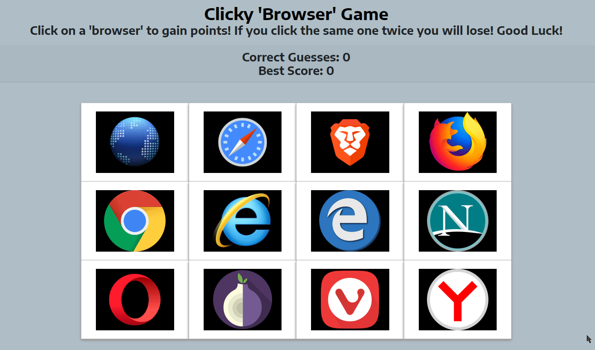

## Clicky React Game
When the user clicks on the images, the images shuffle by changing their position. The user must click each image only once to guess and achieve one point to their score and if an image was clicked twice, the game resets.

## Getting Started
Download the "images" folder to visualize how this application works!

## Demo:
This is simple memorization and click game. The object of the game is to click on only one 'browser' once. If you repeat guesses, you lose and the score is reset to 0. You win by reaching the max score total of 12.

Each click triggers the board of cards to reshuffle, thus, you cannot simply click the cards in the order in which they appear on screen.

The counters are displayed to the top of the board keep track of your current as well as top score.

## Technologies Used:
* HTML5
* CSS3
* Bootstrap4
* React
* Javascript ES6
* Netlify Cloud

# Clicky React Game - Project Made by Muhammad Ali
